# Architecture

Документ описывает фактическую архитектуру текущего checkout после объединения с frontend из архива `aml-graph-main (2).zip`.

## Data Flow

```mermaid
flowchart LR
    A["CSV upload"] --> B["FastAPI upload endpoint"]
    B --> C["pandas validation and normalization"]
    C --> D["NetworkX MultiDiGraph"]
    D --> E["AML detectors"]
    E --> F["Risk scoring"]
    F --> G["Server-side layout"]
    G --> H["Clustering"]
    H --> I["In-memory SessionStore"]
    I --> J["SSE stream and Graph API"]
    J --> K["Next.js frontend with cosmos.gl"]
```



## Backend

Фактический backend runtime:

- FastAPI;
- pandas;
- NetworkX;
- Pydantic;
- in-memory `SessionStore`;
- SSE endpoint.

Основной pipeline расположен в:

- `backend/src/usecases/upload_graph.py`;
- `backend/src/usecases/stream_graph.py`;
- `backend/src/graph/ibm.py`;
- `backend/src/graph/builder.py`;
- `backend/src/graph/detectors.py`;
- `backend/src/graph/scoring.py`;
- `backend/src/graph/layout.py`;
- `backend/src/graph/clustering.py`;
- `backend/src/graph/serialization.py`.

## Frontend

Frontend взят из архивной версии проекта и расположен в `frontend/src`.

Ключевые части:

- `frontend/src/app/page.tsx` - upload page;
- `frontend/src/app/graph/[sessionId]/page.tsx` - graph investigation page;
- `frontend/src/components/GraphCanvas.tsx` - cosmos.gl graph visualization;
- `frontend/src/components/FileUploader.tsx` - CSV upload flow;
- `frontend/src/components/ColumnMapper.tsx` - custom CSV mapping;
- `frontend/src/components/Sidebar.tsx` - filters and pattern toggles;
- `frontend/src/components/DetailPanel.tsx` - node details;
- `frontend/src/lib/api-client.ts` - client for current backend endpoints;
- `frontend/src/lib/sse-client.ts` - SSE client with `EventSource` and `fetch` streaming fallback.

Архивный frontend изначально ожидал endpoints `/api/v1/graph/processing/...`. В текущем проекте он адаптирован к backend endpoints `/api/v1/upload...` и `/api/v1/stream...`.

## Storage

Текущий backend хранит результаты в памяти. Перезапуск backend удаляет session results.

PostgreSQL, Redis, RabbitMQ, Taskiq и LadybugDB присутствовали в архивной архитектуре, но не используются в текущем backend runtime.

## Docker

В репозитории есть `Dockerfile` и `docker-compose.yaml` для backend и frontend. PostgreSQL, Redis, RabbitMQ, worker и постоянное хранилище результатов в текущий compose не входят.

В текущей рабочей машине Docker CLI не найден, поэтому Docker Compose не считается проверенным запуском. Для проверки на машине с Docker:

```powershell
copy .env.example .env
docker compose -f docker-compose.yaml --env-file .env config
docker compose -f docker-compose.yaml --env-file .env up --build
```

## Clustering

Текущий backend вычисляет cluster labels для frontend:

- для небольших графов используется NetworkX Louvain communities;
- для графов крупнее порога используется WCC fallback, чтобы pipeline оставался быстрым;
- результат передаётся во frontend через SSE event `analysis_result`.

AGC в текущем backend pipeline не реализован.

## SSE

Фактический stream endpoint:

```http
GET /api/v1/stream/{session_id}
```

Основные события:

- `started`;
- `parsed`;
- `graph_built`;
- `graph_meta`;
- `nodes_chunk`;
- `edges_chunk`;
- `layout_done`;
- `detectors_done`;
- `detector_result`;
- `analysis_result`;
- `scoring_done`;
- `completed`;
- `stream_done`.

## Limitations

- Нет persistent storage.
- Нет worker queue в текущем backend runtime.
- Нет AGC clustering в текущем pipeline.
- Нет GNN scoring.
- Layout и детекторы ограничены возможностями NetworkX/in-memory подхода.
